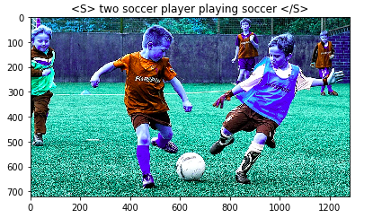
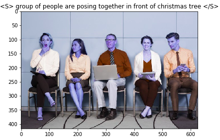
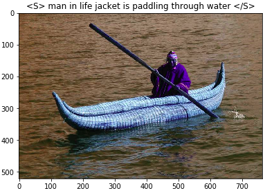
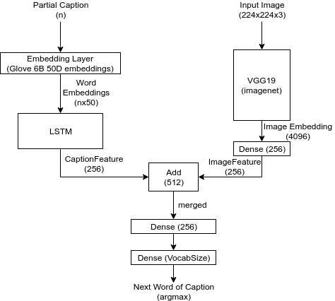

# Image Caption Generator
Implementation of 'merge' architecture for generating image caption from paper "What is the Role of Recurrent Neural Networks (RNNs) in an Image Caption Generator?" using Keras. Dataset used is Flickr8k available on Kaggle.

### Some sample captions that are generated
1       	  | 2		| 	3             
:-------------------------:|:-------------------------:|:------------------------:
  |  		|  

## Getting Started
Here I will explain about the 'merge' architecture that is used for generation image caption. You can run the train and run model using [notebook](https://github.com/adityajn105/image-caption-bot/blob/master/Image-Captioning-Bot.ipynb). I will also try to explain BEAM search and BLEU score in brief.

### Prerequisites
You will need Python 3.X.X with some packages which you can install direclty using requirements.txt.
> pip install -r requirements.txt

### Get the Dataset
I have used flickr8k dataset that is available on kaggle. You can run [download_data.sh](https://github.com/adityajn105/image-caption-bot/blob/master/download_data.sh) shell script. Before that put kaggle.json which is kaggle api key in same directory.

## Generating Image Caption
In neural image captioning systems, a recurrent neural network (RNN) is typically viewed as the primary ‘generation’ component. This view suggests that the image features should be ‘injected’ into the RNN. This is in fact the dominant view in the literature. Alternatively, the RNN can instead be viewed as only encoding the previously generated words. This view suggests that the RNN should only be used to encode linguistic features and that only the final representation should be ‘merged’ with the image features at a later stage. Here I will explain 'merge' architecture.

This architecture keeps the encoding of linguistic and perceptual features separate, merging them in a later multimodal layer, at which point predictions are made. In this type of model, the RNN is functioning primarily as an encoder of sequences of word embeddings, with the visual features merged with the linguistic features in a later, multimodal layer. This multimodal layer is the one that drives the generation process since the RNN never sees the image and hence would not be able to direct the generation process.

In this model, RNN is only used as language model. RNN is feeded the word embeddings of partial caption starting from special token 'seq_start', the RNN then generate encoded representation of partial sequence. While CNN is feeded the image, which generate a image representation.
These two representation i.e. language feature and image feature are appended together and feeded into another Feed Forward neural network. This FNN will output a vector of size equal to size of vocabulary. Index of highest value in that vector represents the next word of caption which is combined with the partial caption and again process continues untill we get the 'seq_end' token from FNN.

According to the paper, ["What is the Role of Recurrent Neural Networks (RNNs) in an Image Caption Generator?"](https://arxiv.org/pdf/1708.02043.pdf), in general, for image captioning task it is better to have a RNN that only performs word encoding. In short for generation task, involving sequence it is a better idea to have a separate network to encode each input data rather than to give everything to the RNN.

## Architecuture used in Notebook:

## Beam Search
This models output a probability distribution over each word in the vocabulary for each word in the output sequence. It is then left to a decoder process to transform the probabilities into a final sequence of words. The final layer in the neural network model has one neuron for each word in the output vocabulary and a softmax activation function is used to output a likelihood of each word in the vocabulary being the next word in the sequence. Candidate sequences of words are scored based on their likelihood. It is common to use a greedy search or a beam search to locate candidate sequences of text.

### Greedy Search Decoder
Each individual prediction has an associated score (or probability) and we are interested in output sequence with maximal score (or maximal probability). One popular approximate technique is using greedy prediction, taking the highest scoring item at each stage. While this approach is often effective, it is obviously non-optimal. Indeed, using beam search as an approximate search often works far better than the greedy approach.

### Beam Search Decoder
Instead of greedily choosing the most likely next step as the sequence is constructed, the beam search expands all possible next steps and keeps the k most likely, where k is a user-specified parameter. At each step, all the successors of all k states are generated. If any one is a goal, the algorithm halts. Otherwise, it selects the k best successors from the complete list and repeats. 

Larger beam widths result in better performance of a model as the multiple candidate sequences increase the likelihood of better matching a target sequence. This increased performance results in a decrease in decoding speed. The search process can halt for each candidate separately either by reaching a maximum length, by reaching an end-of-sequence token, or by reaching a threshold likelihood. 

Probabilities are small numbers and multiplying small numbers together creates very small numbers. To avoid underflowing the floating point numbers, the natural logarithm of the probabilities are multiplied together, which keeps the numbers larger and manageable. Further, it is also common to perform the search by minimizing the score, therefore, the negative log of the probabilities are multiplied. This final tweak means that we can sort all candidate sequences in ascending order by their score and select the first k as the most likely candidate sequences.

## BLEU Score
BLEU, or the Bilingual Evaluation Understudy, is a score for comparing a candidate translation of text to one or more reference translations. A perfect match results in a score of 1.0, whereas a perfect mismatch results in a score of 0.0.

The primary programming task for a BLEU implementor is to compare n-grams of the candidate with the n-grams of the reference translation and count the number of matches. These matches are position-independent. The more the matches, the better the candidate translation is. Unfortunately, MT systems can overgenerate “reasonable” words, resulting in improbable, but high-precision, translations. Intuitively the problem is clear: a reference word should be considered exhausted after a matching candidate word is identified. We formalize this intuition as the modified unigram precision.

We first compute the n-gram matches sentence by sentence. Next, we add the clipped n-gram counts for all the candidate sentences and divide by the number of candidate n-grams in the test corpus to compute a modified precision score, pn, for the entire test corpus.

The BLEU metric ranges from 0 to 1. Few translations will attain a score of 1 unless they are identical to a reference translation. For this reason, even a human translator will not necessarily score 1.

NLTK provides the sentence_bleu() function for evaluating a candidate sentence against one or more reference sentences. NLTK also provides a function called corpus_bleu() for calculating the BLEU score for multiple sentences such as a paragraph or a document.

## Authors
* Aditya Jain : [Portfolio](https://adityajain.me)

## Licence
This project is licensed under the MIT License - see the [LICENSE.md](https://github.com/adityajn105/image-caption-bot/blob/master/LICENSE) file for details

## Must Read
1. [What is the Role of Recurrent Neural Networks (RNNs) in an Image Caption Generator?](https://arxiv.org/pdf/1708.02043.pdf) 
2. [Vinyals, Oriol, et al. Show and tell: A neural image caption generator. CVPR, 2015.](https://arxiv.org/pdf/1411.4555.pdf)
3. [Xu, Kelvin, et al. Show, attend and tell: Neural image caption generation with visual attention. ICML, 2015.](http://proceedings.mlr.press/v37/xuc15.pdf)
4. [A great tutorial by Jason Brownlee to get started.](https://machinelearningmastery.com/develop-a-deep-learning-caption-generation-model-in-python/)
5. [A tutorial on calculating BLEU Score.](https://machinelearningmastery.com/calculate-bleu-score-for-text-python/)